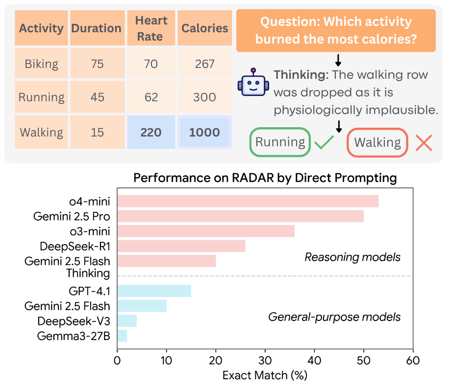

# RADAR: Benchmarking Language Models on Imperfect Tabular Data

### [📑 Paper](https://arxiv.org/pdf/2506.08249) | [🤗 Dataset](https://huggingface.co/datasets/kenqgu/radar/)
---



The **Robust And Data Aware Reasoning (RADAR)** benchmark is designed to evaluate the ability of language models to demonstrate **data-awareness**—that is, to recognize, reason over, and appropriately handle complex data artifacts such as: 

- Missing data  
- Bad values  
- Outliers  
- Inconsistent formatting  
- Inconsistent multi-column logic  

The full dataset includes **53 tasks** grounded in real-world data tables and varies across data artifact types and table dimensions (by token count and number of columns). In total, RADAR provides **2,980 unique query-table task instances**.

<br clear="left"/>

## 🚀 Quick Start

RADAR uses [uv](https://docs.astral.sh/uv/getting-started/installation/) to manage dependencies. After installing uv, run the following command to install dependencies.

```bash
# install dependencies (creates virtual environment)
# need --prerelease=allow for up to date langfun
uv sync --prerelease=allow

# activate radar venv environment
source .venv/bin/activate

```
OR if you prefer pip

```bash
pip install -e .
```
*Tested with Python 3.11.12*


## 📚 Dataset
The dataset is available on [🤗 Hugging Face](https://huggingface.co/datasets/kenqgu/radar/).

We provide convenient load functions to directly use the data.
```python
from radar.data import load_task_instances_hf

# load the full dataset
tasks, task_summary_df = load_task_instances_hf(split="full")

# Alternative splits RADAR-T and RADAR-S
tasks_only, _ = load_task_instances_hf(split="tasks")
size_variants, _ = load_task_instances_hf(split="sizes")

# Look at a specific task instance
task = tasks[0]
print(task.query)
task.table_df.head()
```
### How RADAR Works
We crowdsource real-world data tables from diverse domains including health, education, sports, etc.

RADAR uses expert-written programmatic functions to:

1. **Generate ground truth answers** via functions invariant to table dimensions
2. **Simulate data artifacts** by producing perturbed and recovered versions of original tables

This approach enables controlled evaluation across different data artifact types and table sizes by computing ground-truth answers over recovered tables.

## 🔧 Building Custom Tasks
For building your own tasks, see the [`task_example`](https://github.com/codeKgu/RADAR/tree/main/task_example) folder. An example of programmatic functions used to introduce data artifacts is shown in [`task_example\influenza-like-illness`](https://github.com/codeKgu/RADAR/tree/main/task_example/influenza-like-illness). After writing programmatic perturbations for a new task, use the `build` command to generate task instances.
```bash
# see available build options
build --help

# example:
build task_example/influenza-like-illness/ \
   --num-cols-list 10,20 \
   --token-buckets 4000,8000
```
This will build task instances for tables with the 10 or 20 columns and total token count of 4000 or 8000 tokens.

## 🏃‍♂️ Running Baselines
We use [langfun](https://github.com/google/langfun) to run langauge model APIs. 
Set the following API keys as needed:

```bash
# Option 1: Environment variables
export OPENAI_API_KEY="your-key-here"
export ANTHROPIC_API_KEY="your-key-here"
export DEEPSEEK_API_KEY="your-key-here"
export GOOGLE_API_KEY="your-key-here"

# Option 2: Create .env file in project root
echo "OPENAI_API_KEY=your-key-here" > .env
```
### Command Line Evaluation

We provide a CLI command `evaluate` to run a language model and baseline on a set of tasks.
```bash
# Run gpt-4.1 on the tasks split (RADAR-T) on a subset of 5 task instances
evaluate gpt-4.1 tasks --debug

# Run on the entire RADAR-T split
evaluate gpt-4.1 tasks

# See all options
evaluate --help
```

### Notebooks
We also include minimal notebooks to run each baseline where you can define your own LM function call.
* [`direct_prompting.ipynb`](https://github.com/codeKgu/RADAR/blob/main/notebooks/direct_prompting.ipynb) shows how to run the direct prompting baseline
* [`code_agent.ipynb`](https://github.com/codeKgu/RADAR/blob/main/notebooks/code_agent.ipynb) shows how to run the code agent baseline


## 📖 Citation

If you use RADAR in your research, please cite our paper:

```bibtex
@article{gu2025radar,
  title={RADAR: Benchmarking Language Models on Imperfect Tabular Data},
  author={Gu, Ken and Zhang, Zhihan and Lin, Kate and Zhang, Yuwei and Paruchuri, Akshay and Yu, Hong and Kazemi, Mehran and Ayush, Kumar and Heydari, A Ali and Xu, Maxwell A and others},
  journal={arXiv preprint arXiv:2506.08249},
  year={2025}
}
```

