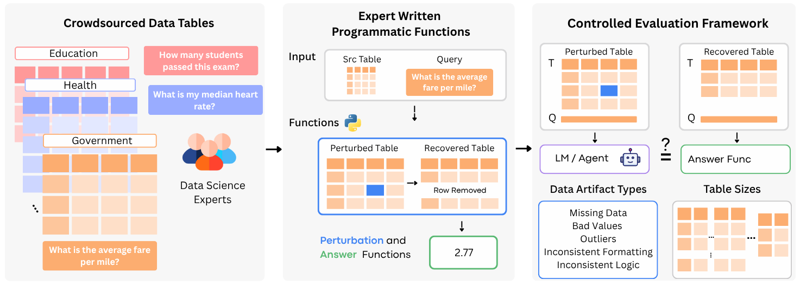
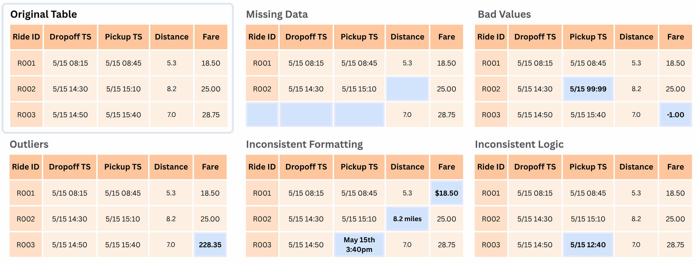

# 👷‍♂️ Building Task Instances


This guide walks you through creating custom RADAR task instances to evaluate language models' data-awareness capabilities. 

## Overview

Building task instances involves:
1. **Data Preparation** - Collecting and cleaning a data table to ensure quality and sufficient size and coming up with a corresponding objective query over the data
2. **Perturbation Functions** - Writing programmatic functions to introduce realistic data artifacts
3. **Instance Generation** - Creating task variants across different table sizes and artifact types

The result is a comprehensive set of evaluation instances that test model robustness across various data quality scenarios.


---


## Step 1: Data Preparation

### Requirements
- **At least 500 rows and 20 or more columns** to support various table configurations (e.g., 5, 10, or 20 columns) and to enable testing with different token counts across column setups.
- **Clean baseline** with no existing data artifacts
- **Real-world relevance** with meaningful column relationships

### Process
1. **Clean your dataset** - Remove inconsistencies, missing values, and errors
2. **Create analytical query** - Come up with a query on the data table
3. **Set up folder structure:**

```
your_task_name/
├── data.csv              # Your cleaned dataset
└── metadata.yaml         # Task configuration
```

💡 **See example:** `task_example/influenza-like-illness/`


## Step 2: Perturbation Functions

Create `radar/tasks/funcs/your_task_name.py`.

### Answer Function
Takes in the dataframe (with the core set of columns) and returns the answer to the query.

For example, the function below is used to answer this query:
> Of the recordings in the dataset, what is the median number of ILI cases with AGE 25-64 for a week? Return your answer rounded to the nearest 1 decimal place. 

```python
@task_registry.register_answer_function("influenza-like-illness")
def influenza_like_illness_answer(df: pd.DataFrame) -> int:
    df = df.copy(deep=True)
    return round(df["ILI AGE 25-64"].median(), 1)
```

### Artifact Functions
Takes in the dataframe and introduces the custom artifacts of the following types:
* missing data
* bad values
* outliers
* inconsistent formatting
* inconsistent logic

Use the associated function decorators (with task-id as the only argument) to register a programmatic function.

💡 **See example:** `radar/tasks/funcs/influenza_like_illness.py`

## Step 3: Generate Instances
If the above is done correctly, we can run the `build` command to generate task instances
```bash
build {path_to_task_folder}
```

For example to build task instances for `influenza-like-illness`
```bash
build task_example/influenza-like-illness
```

This should create a sub-folder `tasks` with task instance JSON files.

### Sanity Check
You should be able to load your task instances with the following code:
```python
from radar.data import load_task_instances_local

task_instances = load_task_instances_local(
        "task_example/influenza-like-illness/tasks"
    )
```